# 🚀 GeminiOCR CI/CD 部署指南

## 📋 概述

本文档详细说明了 GeminiOCR 项目的完整 CI/CD 流程，支持自动化构建、测试、发布和部署。

## 🏗️ CI/CD 架构

```mermaid
graph LR
    A[开发者提交] --> B[GitHub Actions 触发]
    B --> C[构建 & 测试]
    C --> D[安全扫描]
    D --> E[集成测试]
    E --> F[发布到 Docker Hub]
    F --> G[自动部署]
    G --> H[健康检查]
    H --> I[部署完成]
```



## 🎯 核心功能

### ✅ 自动化流程
- **自动触发**: 推送到 main 分支或创建标签时自动执行
- **多服务构建**: 并行构建后端和前端 Docker 镜像
- **语义化版本**: 基于 Git 标签的智能版本管理
- **安全扫描**: 使用 Trivy 进行镜像安全扫描
- **集成测试**: 完整的多服务集成测试
- **零停机部署**: 蓝绿部署和滚动更新策略

### 🐳 Docker 镜像管理
- **Docker Hub 仓库**: `karash062/hya-ocr-sandbox`
- **版本标记策略**:
  - `latest` - 主分支最新版本
  - `v1.0.0` - 语义化版本标签
  - `dev-YYYYMMDD-HASH` - 开发分支构建
  - `main-HASH` - 主分支特定提交

## 📁 文件结构

```
.github/workflows/
├── ci-cd.yml              # 主 CI/CD 工作流
GeminiOCR/
├── docker-compose.ci.yml  # CI 测试配置
├── .dockerignore          # Docker 构建优化
├── backend/
│   ├── .dockerignore      # 后端专用忽略文件
│   └── backend.Dockerfile # 后端镜像配置
├── frontend/
│   ├── .dockerignore      # 前端专用忽略文件
│   └── frontend.Dockerfile# 前端镜像配置
└── deploy.sh              # 增强的部署脚本
```

## 🔧 配置要求

### GitHub Secrets
在 GitHub 仓库设置中添加以下 Secrets：

```
DOCKERHUB_USERNAME    # Docker Hub 用户名
DOCKERHUB_TOKEN       # Docker Hub 访问令牌
```

### 环境变量
```bash
# 部署时可选的环境变量
export DEPLOY_VERSION=v1.0.0                    # 指定部署版本
export DOCKER_REPOSITORY=karash062/hya-ocr-sandbox  # Docker Hub 仓库
```

## 🚀 部署使用指南

### 1. 开发工作流

```bash
# 开发完成后推送到主分支
git add .
git commit -m "feat: 新功能实现"
git push origin main

# CI/CD 将自动执行：
# 1. 构建并测试镜像
# 2. 安全扫描
# 3. 发布到 Docker Hub (latest 标签)
# 4. 可选的自动部署到 staging
```

### 2. 生产发布

```bash
# 创建发布标签
git tag -a v1.0.0 -m "Release version 1.0.0"
git push origin v1.0.0

# CI/CD 将自动执行：
# 1. 构建并测试镜像
# 2. 发布到 Docker Hub (v1.0.0 和 latest 标签)
# 3. 创建 GitHub Release
```

### 3. 生产部署

使用增强的部署脚本进行零停机部署：

```bash
cd GeminiOCR

# 方式1: 自动选择镜像源 (推荐)
./deploy.sh blue-green auto

# 方式2: 强制从 Docker Hub 拉取
./deploy.sh blue-green hub

# 方式3: 本地构建
./deploy.sh blue-green local

# 指定版本部署
DEPLOY_VERSION=v1.0.0 ./deploy.sh blue-green hub
```

## 📊 部署策略详解

### 蓝绿部署 (推荐)
```bash
./deploy.sh blue-green [镜像源]
```
- **优点**: 零停机时间，快速回滚
- **适用**: 生产环境，重要更新
- **流程**: 启动新实例 → 健康检查 → 切换流量 → 停止旧实例

### 滚动更新
```bash
./deploy.sh rolling [镜像源]
```
- **优点**: 资源利用率高，逐步更新
- **适用**: 小型更新，资源受限环境
- **流程**: 逐个服务更新 → 健康检查 → 继续下一个

### 镜像源选项

| 选项 | 说明 | 使用场景 |
|-----|------|----------|
| `auto` | 自动选择 (默认) | 智能选择最佳源 |
| `hub` | 强制 Docker Hub | 生产部署，使用 CI 构建的镜像 |
| `local` | 强制本地构建 | 开发环境，自定义修改 |

## 🧪 测试流程

### 1. 单元测试
```bash
# 后端测试
cd GeminiOCR/backend
python -m pytest tests/ -v

# 前端测试
cd GeminiOCR/frontend
npm test
```

### 2. 集成测试
```bash
# 使用 CI 配置运行完整集成测试
cd GeminiOCR
docker-compose -f docker-compose.ci.yml up -d
docker-compose -f docker-compose.ci.yml run --rm test-runner
```

### 3. 安全扫描
CI 流程自动运行 Trivy 安全扫描，结果上传到 GitHub Security 标签。

## 📈 监控和日志

### 健康检查
- **后端**: `http://localhost:8000/health`
- **前端**: `http://localhost:3000/`
- **系统**: `http://localhost/health`

### 日志查看
```bash
# 查看所有服务日志
docker-compose logs -f

# 查看特定服务
docker-compose logs -f backend
docker-compose logs -f frontend

# 查看部署日志
tail -f /var/log/deploy.log
```

### 容器状态
```bash
# 查看服务状态
docker-compose ps

# 查看资源使用
docker stats

# 健康检查
curl -f http://localhost/health
```

## 🔄 版本管理策略

### 分支策略
- **main**: 主分支，自动构建 `latest` 镜像
- **develop**: 开发分支，构建 `dev-YYYYMMDD-HASH` 镜像
- **feature/***: 功能分支，仅运行测试

### 标签策略
- **v1.0.0**: 正式版本，构建 `v1.0.0` 和 `latest` 镜像
- **v1.0.0-beta.1**: 预发布版本，构建 `v1.0.0-beta.1` 镜像
- **v1.0.0-alpha.1**: 内测版本，构建 `v1.0.0-alpha.1` 镜像

## 🛠️ 故障排除

### 常见问题

**1. Docker Hub 推送失败**
```bash
# 检查认证
docker login
echo $DOCKERHUB_TOKEN | docker login -u $DOCKERHUB_USERNAME --password-stdin
```

**2. 健康检查失败**
```bash
# 检查服务状态
docker-compose ps
docker-compose logs backend

# 手动健康检查
curl -v http://localhost:8000/health
```

**3. 部署脚本失败**
```bash
# 检查前置条件
./deploy.sh -h

# 查看详细日志
./deploy.sh blue-green auto 2>&1 | tee deploy.log
```

**4. 镜像拉取失败**
```bash
# 检查镜像是否存在
docker manifest inspect karash062/hya-ocr-sandbox-backend:latest

# 强制本地构建
./deploy.sh blue-green local
```

### 回滚策略

**1. 快速回滚**
```bash
# 回滚到上一个工作版本
DEPLOY_VERSION=v1.0.0 ./deploy.sh blue-green hub
```

**2. 紧急回滚**
```bash
# 停止服务并回滚
docker-compose down
docker-compose up -d
```

## 📞 支持

如遇到问题：
1. 查看 [GitHub Actions 日志](../../actions)
2. 检查 [Docker Hub 镜像](https://hub.docker.com/r/karash062/hya-ocr-sandbox)
3. 运行健康检查和日志分析
4. 提交 GitHub Issue

---

🎉 **恭喜！** 您现在拥有完整的企业级 CI/CD 流程，支持自动化构建、测试、发布和零停机部署。
